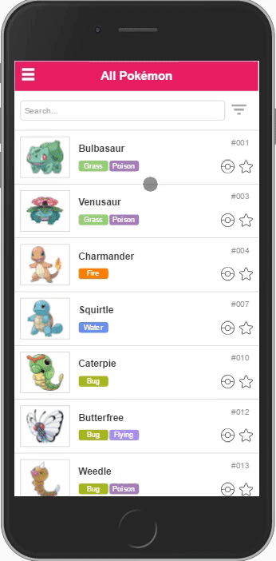

## Demo:



## Steps to run the app:

1. Install the required dependencies listed in package.json and bower.json:

 ```
 npm install & bower install
 ```

2. Run automated tasks and get the dist folder

 ```
 gulp
 ```

3. Start the app

 ```
 npm start
  OR
 node server.js
 ```

#### Tests:

- Unit tests:

 ```
 gulp unit-tests
 ```

- End to end tests:

 ```
 protractor protractor-tests\conf.js
 ```


## Technical requirements:

- [x] Use Angular.js as JavaScript Client MV*
- [ ] Use Less  preprocessor to create the CSS 
      - [x] Sass used instead
- [x] Use Yeoman to create the application scaffold
- [x] Use Gulp as JavaScript task runner
- [x] Use Bower for dependency management
- [x] Use Bootstrap 3.x.x as a UI Framework (WARNING: It’s not allow to use Angular Materials, Angular UI, Bootstrap UI or any other UI framework that has built-in directives)
- [x] Use Git and GitHub for version control
- [x] Use Object-Oriented JavaScript (ECMAScript 5.1 standard. See ECMA-262)
- [x] Use Google Chrome browser (for development and testing)
- [x] Create at least once the following components:
      - [x] Directives
      - [x] Controllers
      - [x] Services
      - [x] Modules
      - [x] Scope
      - [x] Filter
- [x] Test code via Unit Testing
      - [x] All tests must pass (no failures)
      - [ ] Have a 40% code coverage, at least.
- [x] Test end-to-end functionality (user stories) with Protractor
      - [x] All tests must pass (no failures)
- [ ] Use the Pokéapi v2 public API to obtain the information about the Pokémon: http://pokeapi.co
      - [x] Created an API in express.js instead.
- [ ] The web application and data should be available offline
- [x] Use Local Storage for:
      - [x] Battle Box (see Appendix B).
      - [x] Caught list
